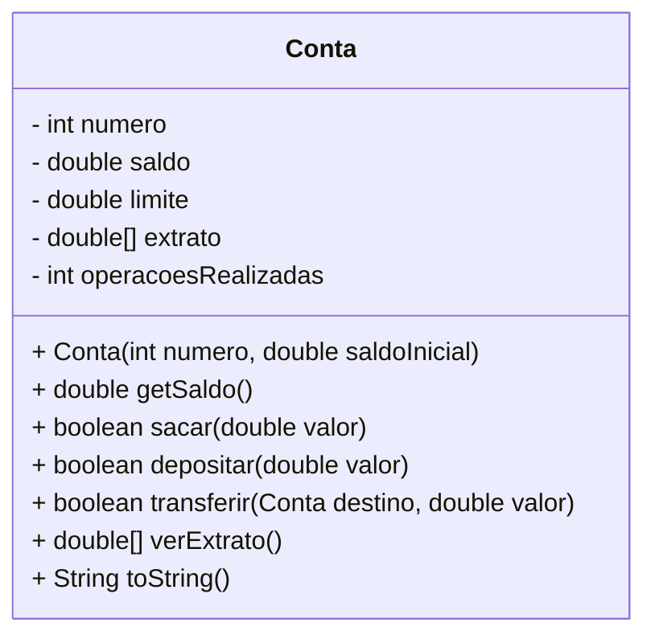

[](https://classroom.github.com/online_ide?assignment_repo_id=17508315&assignment_repo_type=AssignmentRepo)
# Conta Bancária Simples

A idea desta atividade é que você seja capaz de implementar as funcionalidades
básicas de uma conta bancária.

<figure>
  
  <figcaption style="text-align: center"><a href="https://www.freevector.com/free-iconic-atm-vectors-25886">Image obtida em freevector.com</a></figcaption>
</figure>


- [Requisitos](#requisitos)
- [Diagrama](#diagrama)
- [Exemplo de execução](#exemplo-de-execução)
- [Relatório de Entrega](#relatório-de-entrega)


## Requisitos

- Inicialização
  - Os valores iniciais do limite e do extrato devem ser respectivamente, 100 e uma lista vazia
  - O valor do saldo deve ser informando no momento da criação da conta
  - A conta suporta no máximo 10 operações
- Saldo
  - O saldo da conta é igual ao saldo mais o limite
- Saques
  - Não deve ser possível sacar um valor negativo
  - Não deve ser possível sacar um valor que exceda o limite da conta (saldo + limite)
- Depósitos
  - Não deve ser possível depositar um valor negativo
- Transferência
  - o Usuário deve informar a conta de destino
  - O valor da transferência não pode ser negativo
- Extrato
  - Na lista de operações saques e transferências devem iniciar com o sinal de subtração (-)
  - Apenas os depósitos devem apresentar o sinal de adição (+)
  

## Diagrama



## Exemplo de execução 

```java
public class Runner {

    public static void main(final String[] args) {

        Conta minhaConta = new Conta(1001, 2000);
        System.out.println(minhaConta); //Conta{numero=1001, saldo=2000.0, limite=100.0}

        Conta destino = new Conta(10, 0);

        minhaConta.sacar(200);
        System.out.println(minhaConta); //Conta{numero=1001, saldo=1800.0, limite=100.0}

        if(!minhaConta.sacar(10000)){
            System.out.println("Saldo insuficiente"); //Saldo insuficiente
        }

        minhaConta.depositar(500);
        System.out.println(minhaConta); //Conta{numero=1001, saldo=2300.0, limite=100.0}

        minhaConta.transferir(destino, 400);
        System.out.println(minhaConta); //Conta{numero=1001, saldo=1900.0, limite=100.0}

        if(!minhaConta.transferir(destino, 4000000)) {
            System.out.println("Saldo insuficiente"); //Saldo insuficiente
        }

        minhaConta.sacar(1950);
        System.out.println(minhaConta); //Conta{numero=1001, saldo=0.0, limite=50.0}

        minhaConta.depositar(50);
        System.out.println(minhaConta); //Conta{numero=1001, saldo=0.0, limite=100.0}

        double[] extrato = minhaConta.verExtrato();
        for(int i = 0; i < extrato.length; i++) {
            System.out.println(extrato[i]); // -200.0 500.0 -400.0 -1950.0 50.0
        }
    }
}
```

## Relatório de Entrega

Não esqueça de preencher o seguinte formulário [Link para formulário](https://forms.gle/yADAXnYegPeYquzV6) ao completar a atividade.
# Conta_bancaria
# Conta_bancaria
# Conta-bancaria
